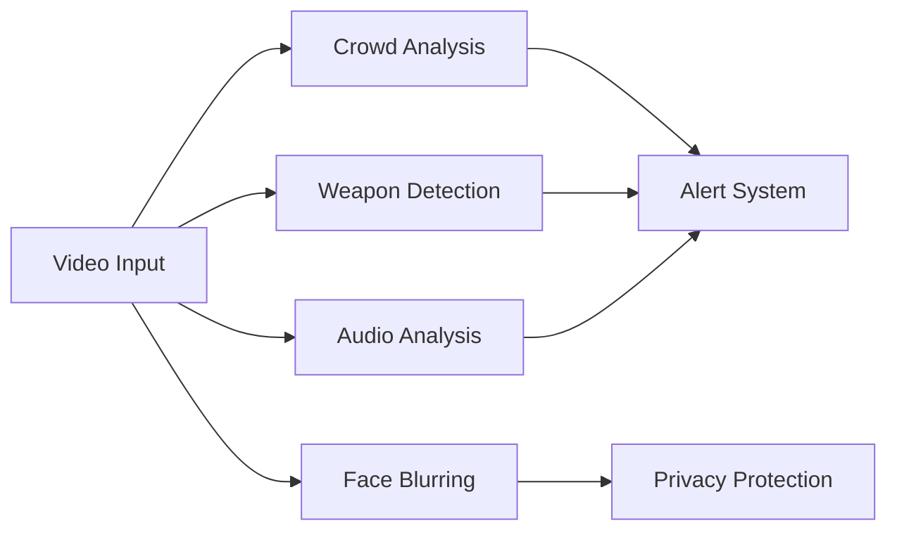
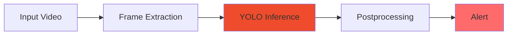

# Violence Detection System

<div align="center">

### AI-powered Real-time Violence Detection for Intelligent Surveillance


</div>

---

## Executive Summary

A comprehensive AI-driven violence detection system designed for intelligent video surveillance. The system leverages YOLOv8 neural networks combined with advanced preprocessing techniques to identify violent behavior in real-time video streams with minimal latency and high accuracy.

**Target Use Cases:**
- Surveillance in public spaces (airports, transit hubs, retail)
- Critical infrastructure protection
- Venue safety monitoring
- Emergency response systems

---

## Key Features

| Feature | Capability |
|---------|-----------|
| **Detection Performance** | Real-time (<2s latency), 85%+ accuracy |
| **Processing** | Optimized inference (PyTorch & ONNX) |
| **Scalability** | Support for 10-20 concurrent video streams |
| **Deployment** | Docker containerization for easy deployment |
| **Flexibility** | Multiple inference backends (PyTorch/ONNX) for different hardware |

---

## System Architecture

The system is built on a modular microservices architecture:

```
┌─────────────────────────────────────────────────────┐
│          VIDEO INPUT SOURCES                        │
│  IP Cameras (RTSP) │ Webcams │ Video Files          │
└────────────┬────────────────────────────────────────┘
             │
             ▼
┌─────────────────────────────────────────────────────┐
│          MEDIA PROCESSING LAYER                     │
│  Frame Extraction │ Preprocessing │ Streaming       │
└────────────┬────────────────────────────────────────┘
             │
             ▼
┌─────────────────────────────────────────────────────┐
│       AI DETECTION SERVICE                          │
│  YOLOv8 (PyTorch/ONNX) │ OpenCV │ GPU/CPU Inference │
└────────────┬────────────────────────────────────────┘
             │
             ▼
┌─────────────────────────────────────────────────────┐
│         BACKEND SERVICES                            │
│  FastAPI │ PostgreSQL │ Redis │ Authentication      │
└────────────┬────────────────────────────────────────┘
             │
             ▼
┌─────────────────────────────────────────────────────┐
│      USER-FACING INTERFACES                         │
│  Web Dashboard (React) │ Mobile App (Flutter)       │
└─────────────────────────────────────────────────────┘
```

---

## Technical Specifications

### AI Model

- **Base Architecture**: YOLOv8 Nano (lightweight, optimized)
- **Training Data**: RWF-2000 violence detection dataset
- **Inference Modes**:
  - **PyTorch**: Full precision, best accuracy
  - **ONNX**: Quantized, optimized for CPU/edge devices
- **Input Formats**: 320×320, 384×384, 512×512 (configurable)

### Performance Characteristics

| Metric | PyTorch | ONNX (CPU) |
|--------|---------|-----------|
| Latency (GPU) | 1-3ms | N/A |
| Latency (CPU) | 10-30ms | 2-5ms |
| Model Size | 12MB | 4MB |
| Memory Usage | 300MB+ | 50MB+ |
| Accuracy | 100% baseline | ~98% vs PyTorch |

### Infrastructure

- **Backend Framework**: FastAPI (async, high-performance)
- **Database**: PostgreSQL (structured data), Redis (caching)
- **Containerization**: Docker + Docker Compose
- **Streaming**: RTSP protocol via MediaMTX
- **Security**: JWT authentication, encrypted communications

---

## Project Structure

```
violence-detection/
├── ai_service/                    # AI Detection Engine
│   ├── detection/                 # Detection implementations
│   │   ├── pytorch_detector.py    # YOLOv8 PyTorch inference
│   │   └── onnx_inference.py      # YOLOv8 ONNX inference
│   ├── common/preprocessing/      # Data preprocessing
│   ├── models/weights/            # Model weights storage
│   ├── config/                    # Configuration management
│   ├── utils/                     # Utilities & helpers
│   └── tests/                     # Comprehensive testing suite
│
├── backend/                       # FastAPI Backend Service
│   ├── main.py                    # Application entry point
│   ├── src/
│   │   ├── core/                  # Configuration & logging
│   │   ├── domain/                # Business entities
│   │   ├── application/           # Use cases & business logic
│   │   ├── infrastructure/        # External integrations
│   │   └── presentation/          # API endpoints
│   ├── docker-compose.yml         # Service orchestration
│   └── Dockerfile                 # Container definition
│
├── admin-dashboard/               # React Web Dashboard (UI Layer)
├── flutter-app/                   # Flutter Mobile App (UI Layer)
├── utils/                         # Utility scripts
└── docs/                          # Documentation
```

---

## Technology Stack

### Core Technologies
- **Python 3.11+**: Primary development language
- **PyTorch**: Deep learning framework
- **YOLOv8**: Object detection model
- **ONNX Runtime**: Cross-platform inference
- **FastAPI**: Async web framework
- **OpenCV**: Computer vision preprocessing

### Infrastructure & DevOps
- **Docker**: Containerization
- **Docker Compose**: Multi-container orchestration
- **PostgreSQL**: Relational database
- **Redis**: In-memory caching & queuing
- **MediaMTX**: RTSP streaming server

### Frontend
- **React**: Web dashboard
- **Flutter**: Cross-platform mobile app

---

## System Requirements

### Development
- Python 3.11 or higher
- 8GB RAM minimum
- CUDA 11.8+ (optional, for GPU acceleration)

### Production
- Docker & Docker Compose
- GPU (recommended) or CPU (supported)
- 16GB+ RAM
- 50GB+ storage (for video logs)

---

## Quick Overview

### Detection Pipeline

1. **Frame Acquisition**: Frames from RTSP streams, webcams, or files
2. **Preprocessing**: Resize, normalize, prepare for neural network
3. **Inference**: YOLOv8 forward pass (GPU/CPU)
4. **Post-processing**: NMS filtering, confidence thresholding
5. **Alert Generation**: Trigger notifications if violence detected
6. **Logging**: Store results in database for analytics

### Quality Assurance

The project includes comprehensive testing:
- **Unit Tests**: test cases for core components
- **Integration Tests**: End-to-end detection workflows
- **Performance Tests**: Latency & throughput benchmarks
- **Accuracy Tests**: Model performance validation

---

## Notable Features

### Multi-Backend Support
Deploy the same trained model across different platforms:
- **PyTorch backend**: Full precision inference (GPU-optimized)
- **ONNX backend**: Quantized inference (CPU-optimized)
- **Automatic selection**: Based on available hardware

### Modular Architecture
Each component is independently deployable:
- Detection service can run standalone
- Backend API is independent of frontend
- Easy to swap inference engines

### Comprehensive Logging
- Frame-by-frame detection results
- Performance metrics tracking
- Event history & analytics
- Audit trails for security

---

## Development Team

**Lead Developer**: tiao051

The project is actively maintained and welcomes community contributions.

---

## Acknowledgments

### Technologies & Resources
- **YOLOv8**: Ultralytics for state-of-the-art object detection
- **PyTorch**: Meta for deep learning framework
- **OpenCV**: Computer vision community
- **FastAPI**: Starlette team for async web framework

### Datasets
- **RWF-2000**: Real World Fight Dataset for model training

---

## License

This project is provided for educational and research purposes.

---

<div align="center">

### For Detailed Documentation

Please refer to individual component READMEs:
- [Backend Service Documentation](backend/README.md)
- [AI Service Documentation](ai_service/README.md)

---

**Last Updated**: November 2025

**Status**: 🔄 In Active Development

</div>
        │  Flutter App  │            │ React Dashboard  │
        └───────────────┘            └──────────────────┘
```

### Components

#### 1. Video Input Sources
- **IP Cameras**: RTSP/ONVIF protocol support
- **Webcam**: WebRTC integration
- **File Upload**: MP4, AVI, MOV formats
- **Live Streaming**: RTMP/HLS streams

#### 2. Media Processing Layer
- **FFmpeg Service**: Video preprocessing and frame extraction
- **Streaming Server**: Node Media Server / Ant Media Server
- **Video Storage**: MinIO S3-compatible storage

#### 3. AI Detection Service
- **Framework**: PyTorch with ONNX Runtime for inference
- **Model**: Fine-tuned YOLO for violence detection
- **Preprocessing**: OpenCV for frame processing
- **GPU Support**: CUDA-enabled Docker container
- **Inference Engine**: TensorRT/ONNX Runtime for optimized performance

#### 4. Backend Services
- **API Gateway**: FastAPI/Kong for routing and load balancing
- **Authentication**: JWT + OAuth 2.0
- **Event Processing**: Apache Kafka/RabbitMQ + Redis
- **Databases**:
  - PostgreSQL: User data, configurations, event logs
  - MongoDB: Video metadata, analysis results
  - InfluxDB: Time-series analytics data
- **Notification Service**: FCM + WebSocket + Email

#### 5. Frontend Applications
- **Mobile App**: Flutter-based iOS/Android application
- **Web Dashboard**: React + TypeScript admin panel

#### 6. DevOps & Monitoring
- **Containerization**: Docker + Docker Compose
- **CI/CD**: GitHub Actions
- **Monitoring**: Prometheus + Grafana + ELK Stack
- **Load Balancing**: NGINX + HAProxy

---

## Features

### AI Detection

**Real-time Processing**: Stream processing with low latency (<2s)

**Violence Categories**:
```
├── Physical Violence (fighting, assault)
├── Weapon-based Violence (knife, gun detection)
├── Group Violence (riots, brawls)
├── Vandalism (property destruction)
└── Aggressive Behavior (threatening gestures)
```

**Advanced Capabilities**:
- Adaptive Threshold: Auto-adjust sensitivity based on context
- False Positive Reduction: Multi-stage validation
- Continuous Learning: Improve from user feedback

### Mobile Application (Flutter)

| Feature | Description |
|---------|-------------|
| **Authentication** | Login/Register with biometric support |
| **Live Monitoring** | Multi-camera grid view |
| **Smart Alerts** | Violence alerts with severity classification |
| **Quick Response** | Emergency buttons (call police/security) |
| **Evidence Collection** | Auto-save video clips when violence detected |
| **Offline Mode** | Cache data when connection lost |
| **Multi-language** | Vietnamese + English |

### Web Dashboard (React)

**Core Features**:
- Real-time Dashboard: Grid view for multiple cameras
- Alert Management: Process and categorize alerts
- Analytics: Statistics charts by time/location
- User Management: Role-based access control
- System Configuration: AI model settings
- Report Generation: Export PDF/Excel reports
- Map Integration: Display camera locations on map

### Advanced Features



- **Crowd Analysis**: Detect crowds and potential riots
- **Weapon Detection**: Identify weapons in video
- **Face Blurring**: Automatic privacy protection
- **Audio Analysis**: Detect screams, gunshots
- **Integration APIs**: Webhook, REST API for third-party systems

---

## Technology Stack

### AI Service

```python
Language:    Python 3.8+
Framework:   PyTorch
Inference:   ONNX Runtime, TensorRT
Vision:      OpenCV, MediaPipe
Model:       Fine-tuned YOLO (YOLOv5/YOLOv8)
```

### Backend

```yaml
Framework:      FastAPI (Python)
Databases:      
  - PostgreSQL  # User data, configurations, event logs
  - MongoDB     # Video metadata, analysis results
  - Redis       # Caching, session management
  - InfluxDB    # Time-series analytics
Message Queue:  Apache Kafka / RabbitMQ
Storage:        MinIO (S3-compatible)
Auth:           JWT, OAuth 2.0
```

### Frontend

<table>
<tr>
<td width="50%">

**Mobile App (Flutter)**
```dart
Framework:   Flutter 3.0+
State:       Riverpod / Bloc
Network:     Dio
Realtime:    flutter_webrtc
Push:        firebase_messaging
Storage:     sqflite
```

</td>
<td width="50%">

**Web Dashboard (React)**
```javascript
Framework:   React 18 + TypeScript
UI:          Ant Design Pro
State:       Redux Toolkit
Realtime:    Socket.io
Charts:      Recharts
Video:       WebRTC
```

</td>
</tr>
</table>

### DevOps

| Component | Technology |
|-----------|-----------|
| **Containerization** | Docker, Docker Compose |
| **CI/CD** | GitHub Actions |
| **Monitoring** | Prometheus, Grafana, ELK |
| **Web Server** | NGINX |

---

---

## AI Model

### Pipeline



### Training Datasets

| Dataset | Description | Size |
|---------|-------------|------|
| **RWF-2000** | Real World Fighting | 2,000 videos |
| **HMDB-51** | Violence subset | 51 action classes |
| **UCF-Crime** | Crime and violence | 1,900 videos |
| **Violence in Movies** | Movie violence scenes | Various |
| **Custom Dataset** | Vietnam-specific context | TBD |

### Performance Metrics

```yaml
Target Accuracy:     >85%
Precision:          High (reduce false alarms)
Recall:             High (catch all incidents)
Inference Time:     <100ms per frame
FPS:                10-30 fps (hardware dependent)
```

> **📖 Detailed Documentation**: See [`ai-service/README.md`](ai-service/README.md) for implementation details

---

---

## Security

| Layer | Implementation |
|-------|----------------|
| **Authentication** | JWT-based with refresh tokens |
| **Authorization** | Role-based access control (RBAC) |
| **Encryption** | SSL/TLS for all communications |
| **Privacy** | Automatic face blurring in recordings |
| **API Security** | Rate limiting, CORS, input validation |
| **Data Protection** | Encrypted database, secure storage |

> **⚠️ Important**: This system is designed for security and safety purposes. Please ensure compliance with local privacy laws and regulations when deploying surveillance systems.

---

## Monitoring & Analytics

<table>
<tr>
<td width="33%">

**System Metrics**
- CPU usage
- GPU utilization
- Memory consumption
- Network bandwidth

</td>
<td width="33%">

**AI Metrics**
- Inference time
- Model accuracy
- False positive rate
- Detection latency

</td>
<td width="33%">

**Business Metrics**
- Total alerts
- Response time
- Resolution rate
- Incident trends

</td>
</tr>
</table>

**Monitoring Stack**:
- **Grafana**: Real-time dashboards
- **Prometheus**: Metrics collection and alerting
- **ELK Stack**: Log aggregation and analysis

---

---

## Documentation

| Document | Description |
|----------|-------------|
| [Architecture Documentation](docs/architecture.md) | System design and architecture |
| [AI Pipeline Details](docs/ai-pipeline.md) | AI model and pipeline |
| [Detection Pipeline](docs/detection-pipeline.md) | Violence detection workflow |
| [AI Service README](ai-service/README.md) | AI service implementation |
| [RTSP Simulator](dev-tools/rtsp-simulator/README.md) | Test RTSP cameras for development |
| [API Documentation](http://localhost:8000/docs) | Interactive API docs (when running) |

---

## Contributing

We welcome contributions! Here's how you can help:

```bash
# 1. Fork the repository
# 2. Create your feature branch
git checkout -b feature/AmazingFeature

# 3. Commit your changes
git commit -m 'Add some AmazingFeature'

# 4. Push to the branch
git push origin feature/AmazingFeature

# 5. Open a Pull Request
```

---

## Authors

**tiao051** - *Project Creator & Lead Developer*

---

## Acknowledgments

<table>
<tr>
<td align="center">

**AI & ML**
- YOLOv8 by Ultralytics
- PyTorch Framework
- ONNX Runtime

</td>
<td align="center">

**Datasets**
- RWF-2000 dataset

</td>
<td align="center">

**Community**
- OpenCV community
- Flutter community
- React community

</td>
</tr>
</table>

---

<div align="center">

**Built with ❤️ for a safer world**

[](https://github.com/tiao051)

</div>

