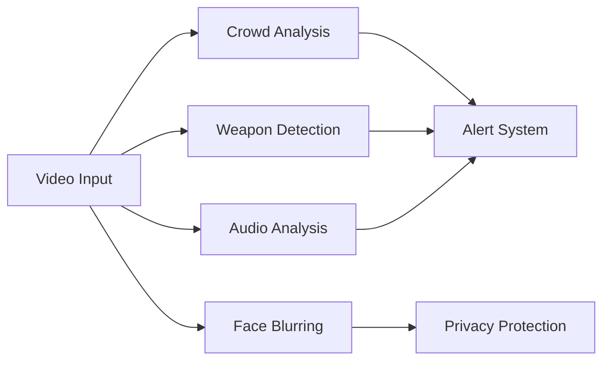
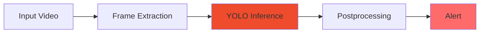

# Violence Detection System

<div align="center">

### AI-powered real-time violence detection system with web dashboard and mobile application


</div>

---

---

## Overview

This project is a comprehensive violence detection system that leverages AI to identify violent behavior in real-time video streams.

<table>
<tr>
<td>

**Key Capabilities**
- Real-time Detection (<2s latency)
- High Accuracy (>85% precision)
- Multi-platform Support
- Scalable Architecture (10-20 streams)
- Smart Alert System

</td>
<td>

**Technical Highlights**
- Unified YOLO-based AI Model
- Microservices Architecture
- Docker Containerization
- Real-time Stream Processing
- Advanced Analytics Dashboard

</td>
</tr>
</table>

### Key Objectives

> **Mission**: Build an intelligent surveillance system that automatically detects and alerts on violent behavior in real-time

- Build an AI system to detect violent behavior in real-time video with high accuracy
- Develop mobile app (Flutter) and web dashboard (React) for monitoring and management
- Implement automatic alert system when violence is detected
- Provide analytics and statistical reporting on violence events

### Technical Requirements

| Requirement | Specification |
|------------|---------------|
| **Response Time** | < 2 seconds from detection to alert |
| **Accuracy** | > 85% (Precision & Recall) |
| **Video Sources** | IP cameras, webcams, file uploads |
| **Concurrent Streams** | 10-20 simultaneous video streams |
| **Storage** | Efficient event history and retrieval |

---

## System Architecture

The system follows a microservices architecture with Docker containerization:

```
┌──────────────────────────────────────────────────────────────────┐
│                         INPUT SOURCES                            │
│     IP Cameras (RTSP/ONVIF) │ Webcams │ File Upload              │
└──────────────────────────────┬───────────────────────────────────┘
                               │
                               ▼
┌──────────────────────────────────────────────────────────────────┐
│                    MEDIA PROCESSING LAYER                        │
│        FFmpeg Service │ Streaming Server │ MinIO Storage         │
└──────────────────────────────┬───────────────────────────────────┘
                               │
                               ▼
┌──────────────────────────────────────────────────────────────────┐
│                   AI DETECTION SERVICE (GPU)                     │
│     YOLO Fine-tuned Model │ OpenCV │ TensorRT/ONNX Runtime       │
└──────────────────────────────┬───────────────────────────────────┘
                               │
                               ▼
┌──────────────────────────────────────────────────────────────────┐
│                       BACKEND SERVICES                           │
│       Auth │ Kafka/RabbitMQ │ PostgreSQL/MongoDB/Redis           │
└──────────────────────────────┬───────────────────────────────────┘
                               │
                ┌──────────────┴──────────────┐
                ▼                             ▼
        ┌───────────────┐            ┌──────────────────┐
        │    MOBILE     │            │       WEB        │
        │  Flutter App  │            │ React Dashboard  │
        └───────────────┘            └──────────────────┘
```

### Components

#### 1. Video Input Sources
- **IP Cameras**: RTSP/ONVIF protocol support
- **Webcam**: WebRTC integration
- **File Upload**: MP4, AVI, MOV formats
- **Live Streaming**: RTMP/HLS streams

#### 2. Media Processing Layer
- **FFmpeg Service**: Video preprocessing and frame extraction
- **Streaming Server**: Node Media Server / Ant Media Server
- **Video Storage**: MinIO S3-compatible storage

#### 3. AI Detection Service
- **Framework**: PyTorch with ONNX Runtime for inference
- **Model**: Fine-tuned YOLO for violence detection
- **Preprocessing**: OpenCV for frame processing
- **GPU Support**: CUDA-enabled Docker container
- **Inference Engine**: TensorRT/ONNX Runtime for optimized performance

#### 4. Backend Services
- **API Gateway**: FastAPI/Kong for routing and load balancing
- **Authentication**: JWT + OAuth 2.0
- **Event Processing**: Apache Kafka/RabbitMQ + Redis
- **Databases**:
  - PostgreSQL: User data, configurations, event logs
  - MongoDB: Video metadata, analysis results
  - InfluxDB: Time-series analytics data
- **Notification Service**: FCM + WebSocket + Email

#### 5. Frontend Applications
- **Mobile App**: Flutter-based iOS/Android application
- **Web Dashboard**: React + TypeScript admin panel

#### 6. DevOps & Monitoring
- **Containerization**: Docker + Docker Compose
- **CI/CD**: GitHub Actions
- **Monitoring**: Prometheus + Grafana + ELK Stack
- **Load Balancing**: NGINX + HAProxy

---

## Features

### AI Detection

**Real-time Processing**: Stream processing with low latency (<2s)

**Violence Categories**:
```
├── Physical Violence (fighting, assault)
├── Weapon-based Violence (knife, gun detection)
├── Group Violence (riots, brawls)
├── Vandalism (property destruction)
└── Aggressive Behavior (threatening gestures)
```

**Advanced Capabilities**:
- Adaptive Threshold: Auto-adjust sensitivity based on context
- False Positive Reduction: Multi-stage validation
- Continuous Learning: Improve from user feedback

### Mobile Application (Flutter)

| Feature | Description |
|---------|-------------|
| **Authentication** | Login/Register with biometric support |
| **Live Monitoring** | Multi-camera grid view |
| **Smart Alerts** | Violence alerts with severity classification |
| **Quick Response** | Emergency buttons (call police/security) |
| **Evidence Collection** | Auto-save video clips when violence detected |
| **Offline Mode** | Cache data when connection lost |
| **Multi-language** | Vietnamese + English |

### Web Dashboard (React)

**Core Features**:
- Real-time Dashboard: Grid view for multiple cameras
- Alert Management: Process and categorize alerts
- Analytics: Statistics charts by time/location
- User Management: Role-based access control
- System Configuration: AI model settings
- Report Generation: Export PDF/Excel reports
- Map Integration: Display camera locations on map

### Advanced Features



- **Crowd Analysis**: Detect crowds and potential riots
- **Weapon Detection**: Identify weapons in video
- **Face Blurring**: Automatic privacy protection
- **Audio Analysis**: Detect screams, gunshots
- **Integration APIs**: Webhook, REST API for third-party systems

---

## Technology Stack

### AI Service

```python
Language:    Python 3.8+
Framework:   PyTorch
Inference:   ONNX Runtime, TensorRT
Vision:      OpenCV, MediaPipe
Model:       Fine-tuned YOLO (YOLOv5/YOLOv8)
```

### Backend

```yaml
Framework:      FastAPI (Python)
Databases:      
  - PostgreSQL  # User data, configurations, event logs
  - MongoDB     # Video metadata, analysis results
  - Redis       # Caching, session management
  - InfluxDB    # Time-series analytics
Message Queue:  Apache Kafka / RabbitMQ
Storage:        MinIO (S3-compatible)
Auth:           JWT, OAuth 2.0
```

### Frontend

<table>
<tr>
<td width="50%">

**Mobile App (Flutter)**
```dart
Framework:   Flutter 3.0+
State:       Riverpod / Bloc
Network:     Dio
Realtime:    flutter_webrtc
Push:        firebase_messaging
Storage:     sqflite
```

</td>
<td width="50%">

**Web Dashboard (React)**
```javascript
Framework:   React 18 + TypeScript
UI:          Ant Design Pro
State:       Redux Toolkit
Realtime:    Socket.io
Charts:      Recharts
Video:       WebRTC
```

</td>
</tr>
</table>

### DevOps

| Component | Technology |
|-----------|-----------|
| **Containerization** | Docker, Docker Compose |
| **CI/CD** | GitHub Actions |
| **Monitoring** | Prometheus, Grafana, ELK |
| **Web Server** | NGINX |

---

---

## AI Model

### Pipeline



### Training Datasets

| Dataset | Description | Size |
|---------|-------------|------|
| **RWF-2000** | Real World Fighting | 2,000 videos |
| **HMDB-51** | Violence subset | 51 action classes |
| **UCF-Crime** | Crime and violence | 1,900 videos |
| **Violence in Movies** | Movie violence scenes | Various |
| **Custom Dataset** | Vietnam-specific context | TBD |

### Performance Metrics

```yaml
Target Accuracy:     >85%
Precision:          High (reduce false alarms)
Recall:             High (catch all incidents)
Inference Time:     <100ms per frame
FPS:                10-30 fps (hardware dependent)
```

> **📖 Detailed Documentation**: See [`ai-service/README.md`](ai-service/README.md) for implementation details

---

---

## Security

| Layer | Implementation |
|-------|----------------|
| **Authentication** | JWT-based with refresh tokens |
| **Authorization** | Role-based access control (RBAC) |
| **Encryption** | SSL/TLS for all communications |
| **Privacy** | Automatic face blurring in recordings |
| **API Security** | Rate limiting, CORS, input validation |
| **Data Protection** | Encrypted database, secure storage |

> **⚠️ Important**: This system is designed for security and safety purposes. Please ensure compliance with local privacy laws and regulations when deploying surveillance systems.

---

## Monitoring & Analytics

<table>
<tr>
<td width="33%">

**System Metrics**
- CPU usage
- GPU utilization
- Memory consumption
- Network bandwidth

</td>
<td width="33%">

**AI Metrics**
- Inference time
- Model accuracy
- False positive rate
- Detection latency

</td>
<td width="33%">

**Business Metrics**
- Total alerts
- Response time
- Resolution rate
- Incident trends

</td>
</tr>
</table>

**Monitoring Stack**:
- **Grafana**: Real-time dashboards
- **Prometheus**: Metrics collection and alerting
- **ELK Stack**: Log aggregation and analysis

---

---

## Documentation

| Document | Description |
|----------|-------------|
| [Architecture Documentation](docs/architecture.md) | System design and architecture |
| [AI Pipeline Details](docs/ai-pipeline.md) | AI model and pipeline |
| [Detection Pipeline](docs/detection-pipeline.md) | Violence detection workflow |
| [AI Service README](ai-service/README.md) | AI service implementation |
| [API Documentation](http://localhost:8000/docs) | Interactive API docs (when running) |

---

## Contributing

We welcome contributions! Here's how you can help:

```bash
# 1. Fork the repository
# 2. Create your feature branch
git checkout -b feature/AmazingFeature

# 3. Commit your changes
git commit -m 'Add some AmazingFeature'

# 4. Push to the branch
git push origin feature/AmazingFeature

# 5. Open a Pull Request
```

---

## Authors

**tiao051** - *Project Creator & Lead Developer*

---

## Acknowledgments

<table>
<tr>
<td align="center">

**AI & ML**
- YOLOv5/YOLOv8 by Ultralytics
- PyTorch Framework
- ONNX Runtime

</td>
<td align="center">

**Datasets**
- RWF-2000 dataset
- UCF-Crime dataset
- HMDB-51 dataset

</td>
<td align="center">

**Community**
- OpenCV community
- Flutter community
- React community

</td>
</tr>
</table>

---

<div align="center">

**Built with ❤️ for a safer world**

[](https://github.com/tiao051)

</div>

